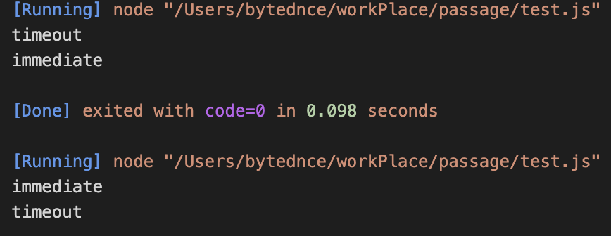
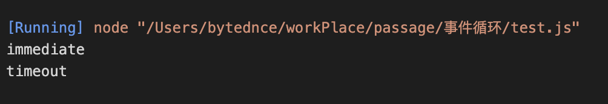

## 事件循环

### 特点可以简单概括为

> 先宏任务，后微任务

#### 宏任务有：

- MAINLINE 代码(个人主观理解)
- TIMER 阶段任务
- POLL 阶段任务
- check 阶段

#### 微任务有：

- process.nextTick
- promise.then

每次执行任务都只执行其中的同步代码，将异步任务（宏任务和微任务）放进队列

node 和浏览器的不同点就在于将队列中的异步任务取出的调度过程，
除此之外，node 的不同版本间也有差别

1. node 中
   node 中的 eventLoop 有六个宏任务队列，优先级从高到低分别称为

```
   ┌───────────────────────┐
┌─>│        timers         │
│  └──────────┬────────────┘
│  ┌──────────┴────────────┐
│  │     I/O callbacks     │
│  └──────────┬────────────┘
│  ┌──────────┴────────────┐
│  │     idle, prepare     │
│  └──────────┬────────────┘      ┌───────────────┐
│  ┌──────────┴────────────┐      │   incoming:   │
│  │         poll          │<─────┤  connections, │
│  └──────────┬────────────┘      │   data, etc.  │
│  ┌──────────┴────────────┐      └───────────────┘
│  │        check          │
│  └──────────┬────────────┘
│  ┌──────────┴────────────┐
└──┤    close callbacks    │
   └───────────────────────┘
```

每个宏任务队列后面是一个微任务队列

其中最关键的是

**timers**:setTimeout/setInterval

**poll**:fs.readfile

**check**:setImediate

三个阶段

node 在执行每个任务又会将其中任务放入对应的队列.

#### Node11 之前

有几种特别的情况：

- 在宏任务中产生微任务：会被放入当前宏任务的微任务队列中，呆本级别宏任务执行完一起执行微任务（注意是一起！！）

- 在宏任务中产生宏任务：如果产生同级别的宏任务，会放入次轮循环，（非同级别正常放入，按照优先级和循环顺序依次执行）

但是上述情况只发生在 node 版本 10 及以前

> node 版本切换办法

- nvm ls(查看所有 node 版本)
- nvm current / node -v(查看当前使用的 node 版本)
- nvm use 12/10（使用指定的版本，只需要写大版本号即可）

#### Node11 之后

在 node11 及以后产生的变化是:一个宏任务执行完就会去清理轮微任务队列，即之前是一个级别的宏任务共享一个微任务队列，现在是一个微任务对应一个一个宏任务队列

#### 浏览器中

在浏览器中规则则简单很多:宏任务没有优先级之分.

每次执行一个宏任务就去清理一次微任务队列，选取宏任务的次序不像 node 中有优先级顺序，完全遵循先进先出的规则

下面是几个示例代码，将分别在 node10 node12 浏览器中执行，加深对上述的理解

-

```javascript
setTimeout(() => {
  console.log("timeout");
}, 0);

setImmediate(() => {
  console.log("immediate");
});
```



结果不确定,因为 setTimeout 属于 timerjieduan,setimemediate 属于 check 阶段,但是 settimeout 的事件 0,并不代表会将其立马放入任务队列中,而 setimmediate 是确实立马放入.

这时是检查任务队列会有两种情况.

1. settimeout 没有被放入队列,先去执行优先级较低的 setimediately
2. settimeout 已经被放入队列,先被执行

```javascript
const fs = require("fs");

fs.readFile(__filename, () => {
  setTimeout(() => {
    console.log("timeout");
  }, 0);
  setImmediate(() => {
    console.log("immediate");
  });
});
```

在这种歌情况下输出是确定的

因为 fs.read 的回调函数是属于 poll 阶段的宏任务,遇到 timeout 和 immediately 会将其放入相应的任务队列中,在 poll 阶段之后回去检查 check 阶段,本轮事件循环结束,到下一轮才开始 timeout 阶段
