清除 cookie 和 disable cache
刷新https://www.zhihu.com/signin?next=%2F
首次得到的 cookie 中 domain 有两个不符合“当前域名或其子域名”

## 第一个

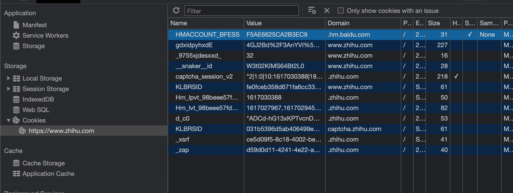
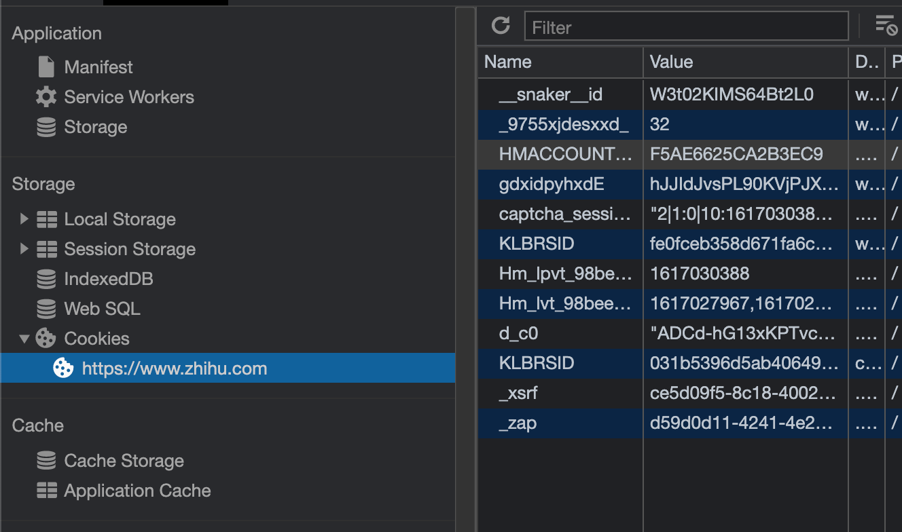

network 中找到属于 hm.baidu.com 的 Url 请求

这个脚本的请求如下

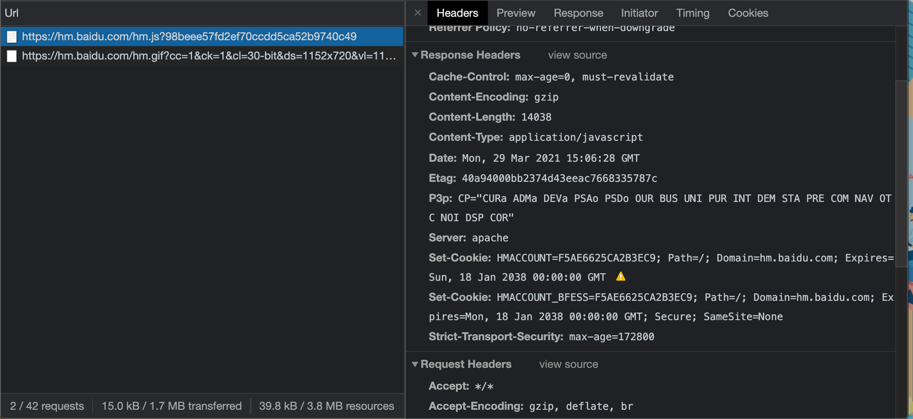

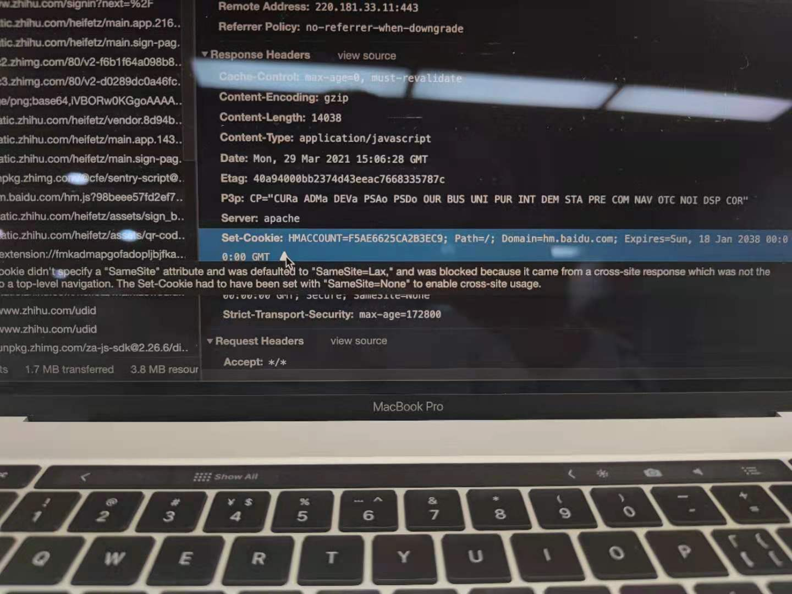

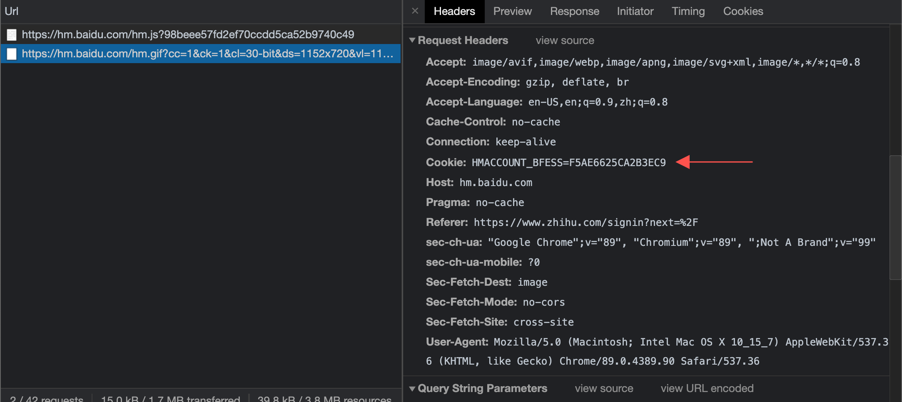

可以看到,这里设置了两个 cookie,但是只有第一个生效了

三方 cookie 的设置
This Set-Cookie was blocked because it has the "SameSite=Lax" attribute but came from a cross-site response which was not the response to a top-level navigation.

cookie 的 domain 和 requestheader 中的 referer 不满足同站,所以被 samesite block 了
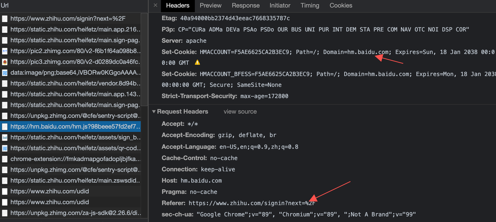
(这里没有同源还是请求成功了是因为是 script 标签发起的链接)
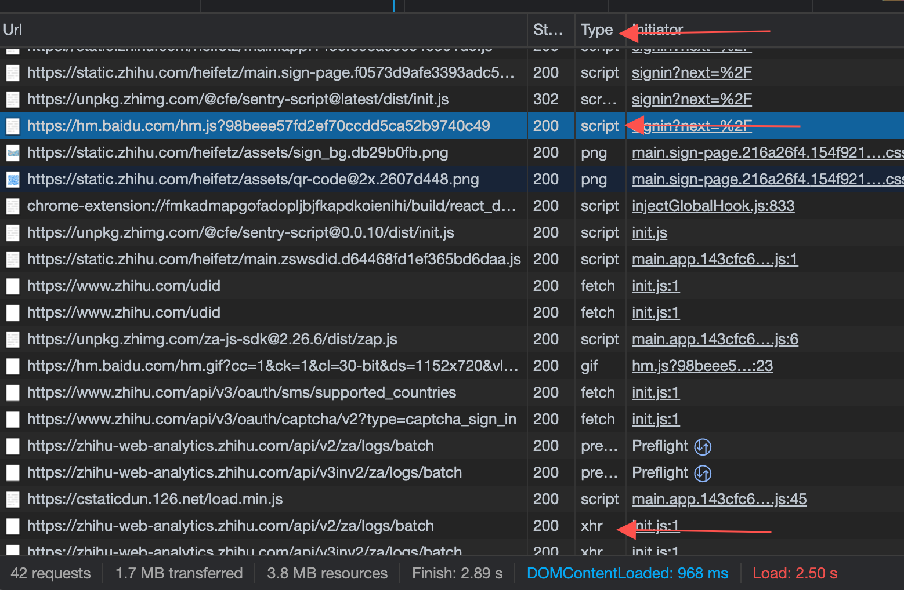
如果是 type 是 xhr 要用 cors 才能请求成功
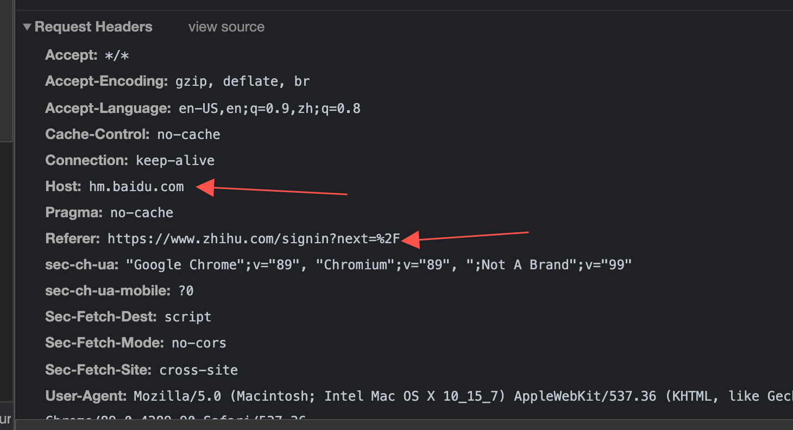

它的 initiator 是第一个文件:

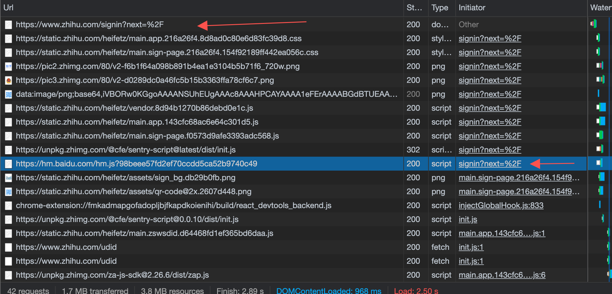
是知乎的 html 页面
粘贴到 vscode 中 查找

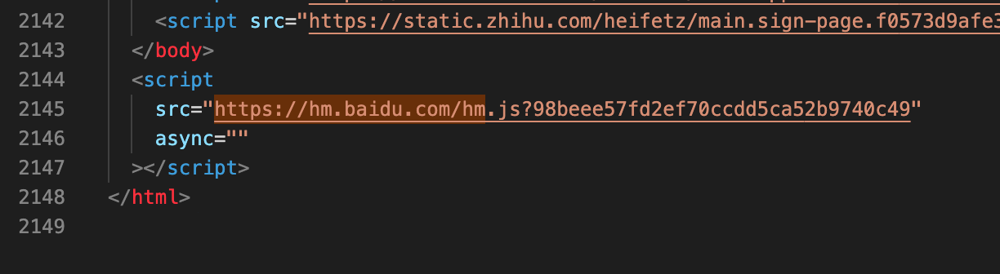

是 html 的 script 引入了一段 js 脚本

## 第二个

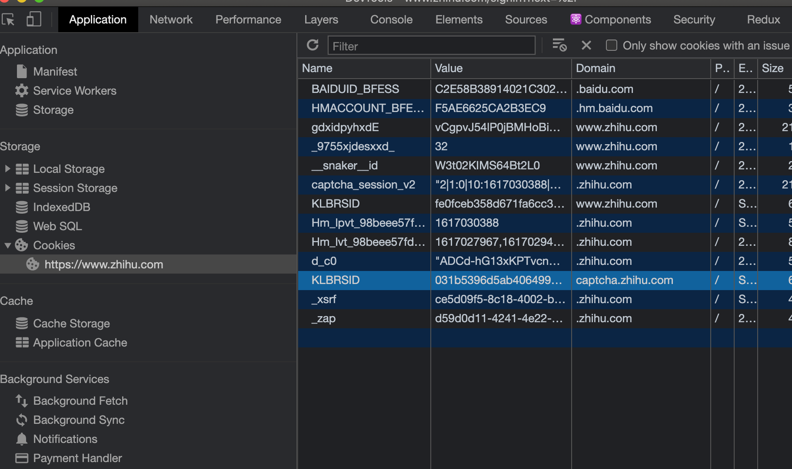

设置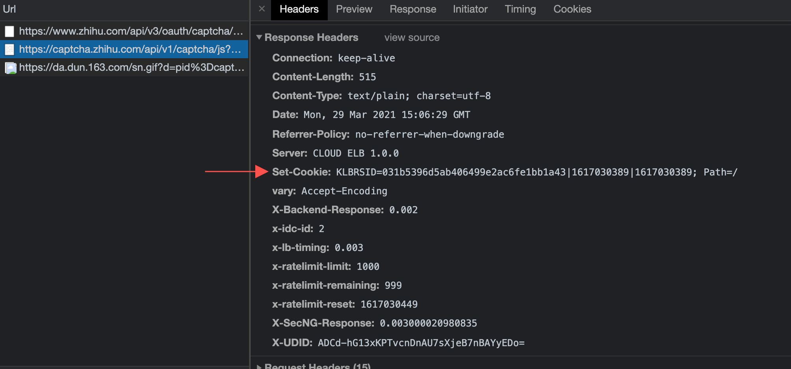

设置在 captcha.zhihu.com 这个 domain 下

cookie 所在的 domain 和 referer 在同一个 site 下,对于www.zhihu.com为referer发起的请求都是第一方cookie
