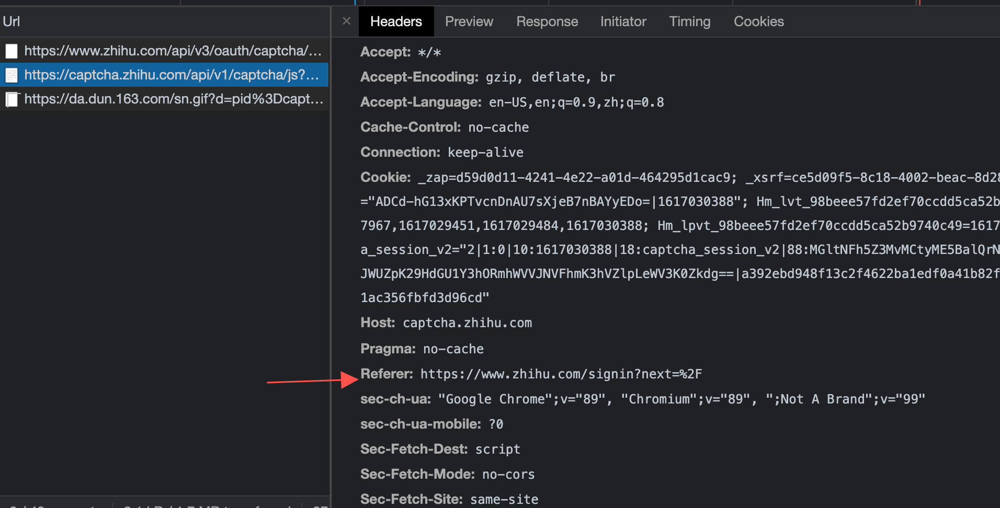

清除 cookie 和 disable cache
刷新https://www.zhihu.com/signin?next=%2F
首次得到的 cookie 中 domain 有两个不符合“当前域名或其子域名”

## 第一个

network 中找到属于 hm.baidu.com 的 Url 请求

这个脚本的请求如下

能设置 domain 为 hm.baidu.com 的请求 host 一定是 hm.baidu.com 或者其子域名

请求 origin 是www.zhihu.com中携带的cookie要么是第一方cookie,要么是设置了sameSite为none和secure的第三方cookie

可以看到,这里设置了两个 cookie,但是只有第一个生效了

三方 cookie 的设置
This Set-Cookie was blocked because it has the "SameSite=Lax" attribute but came from a cross-site response which was not the response to a top-level navigation.

cookie 的 domain 和 requestheader 中的 referer 不满足同站,所以被 samesite block 了

(这里没有同源还是请求成功了是因为是 script 标签发起的链接)

如果是 type 是 xhr 要用 cors 才能请求成功

它的 initiator 是第一个文件:

是知乎的 html 页面
粘贴到 vscode 中 查找

是 html 的 script 引入了一段 js 脚本

## 第二个

设置

设置在 captcha.zhihu.com 这个 domain 下

cookie 所在的 domain 和 referer 在同一个 site 下,对于www.zhihu.com为referer发起的请求都是第一方cookie

使用三方 cookie

作为第一方 cookie 注入的

但是并没有发出可以使用的第三方 cookie
因为在浏览器的 cookie 默认为 samesitelax 后,scrcipt 标签和 img 的 src,默认不带上 cookie

关闭三方 cookie

samesite 为 none 的 cookie 设置不成功 发起请求时也无法带上

知乎的页面有一个 url 是 hm.baidu.com 的请求
使用 mobheader 测试设置跨站 cookie

1.  Domain=.baidu.com;成功
    
    
2.  Domain=.zhihu.com;不成功
    
    
3.  Domain=.taobao.com;不成功
    
    

document.cookie 只能取到同站的&&不是 httpOnly 的 cookie
所有三方 cookie 强制设为 none

所有三方 cookie 强制 strict:setting
