## script 要放在最后?

对 html 中插入 js 和 css 有一个规定,样式放最前面,js 放末尾,这样可以最大程度减少首屏渲染的时间,因为 js 会阻塞 dom 数的渲染,而 css 不会.

感觉很有道理,看看下面这个例子.

准备一个耗时的 js 脚本,并且是同步的.

首先放在 head 中:

```html
<!DOCTYPE html>
<html lang="en">
  <head>
    <script>
      let startOne = Date.now();
      console.log("-------------------------------------");
      while (Date.now() - startOne <= 5000) {}
      console.log("js执行结束");
    </script>
  </head>
  <body>
    <h1>这是第一段html文字</h1>
  </body>
</html>
```

效果如下:


可以看到,5s 之后才能看到页面,

那把 js 放到末尾应该会好一些吧?

```html
<!DOCTYPE html>
<html lang="en">
  <head> </head>
  <body>
    <h1>这是第一段html文字</h1>
  </body>
  <script>
    let startOne = Date.now();
    console.log("-------------------------------------");
    while (Date.now() - startOne <= 5000) {}
    console.log("js执行结束");
  </script>
</html>
```

效果如下:

并没有更好

为什么在最后引入 js 文件也没有让首屏渲染更快呢?

## 浏览器的内容什么时候会渲染

探究其原因前先有几个前置知识:
DOMContentLoaded 事件/Loaded 事件

DOMContentLoaded —— 浏览器已完全加载 HTML，并构建了 DOM 树，但像  和样式表之类的外部资源可能尚未加载完成。

load —— 浏览器不仅加载完成了 HTML，还加载完成了所有外部资源：图片，样式等。

使用 perfermance 面板来查看整个导航流程
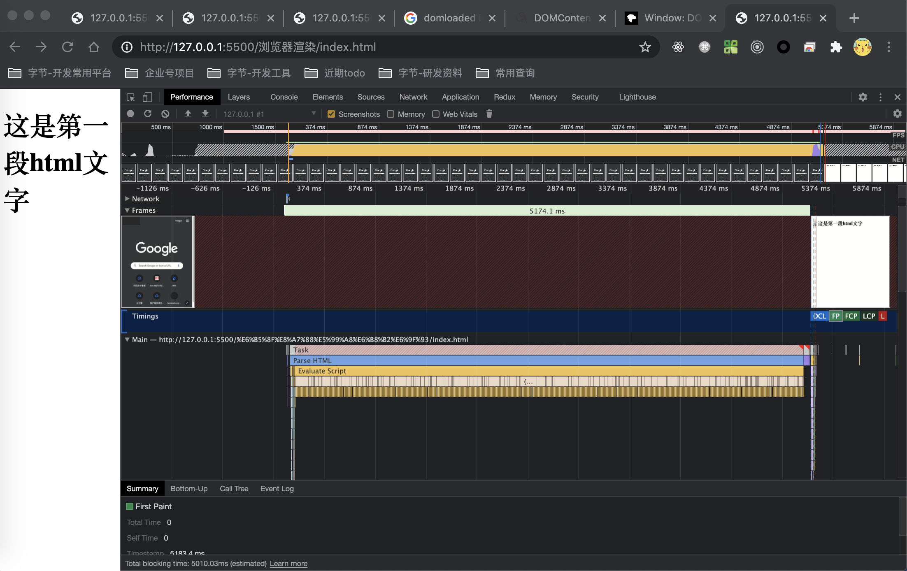

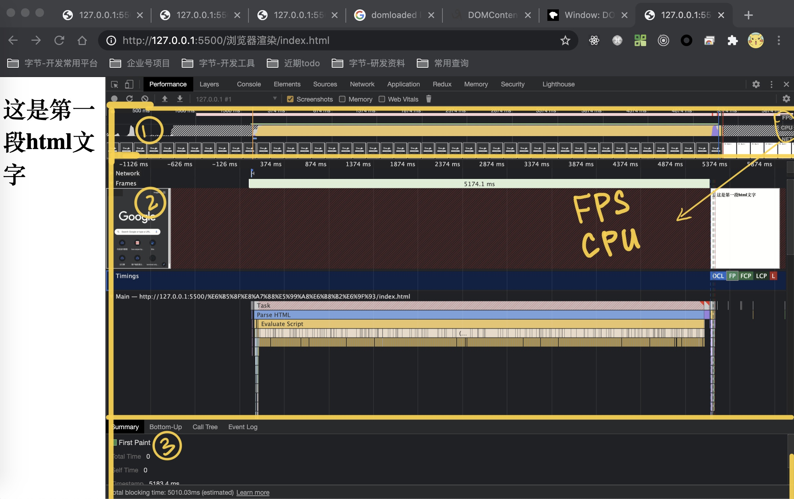
整个面板主要分为三块,1 是预览,2 是 1 的放大,3 是详情

主要使用 2 来研究

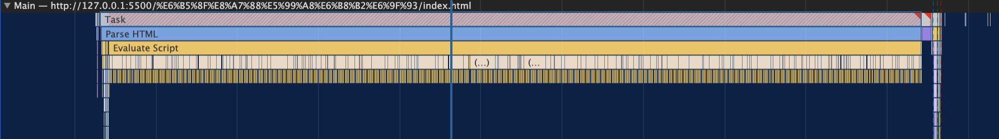

Main 一栏代表的渲染进程的主线程,包括 js 引擎和渲染引擎

纵向看,每一条灰色代表一个宏任务

每一条灰色的下面详细列出栏这一轮宏任务做了什么.

首先看第一个宏任务,第一个宏任务后面是灰色阴影,说明这个任务时间过长
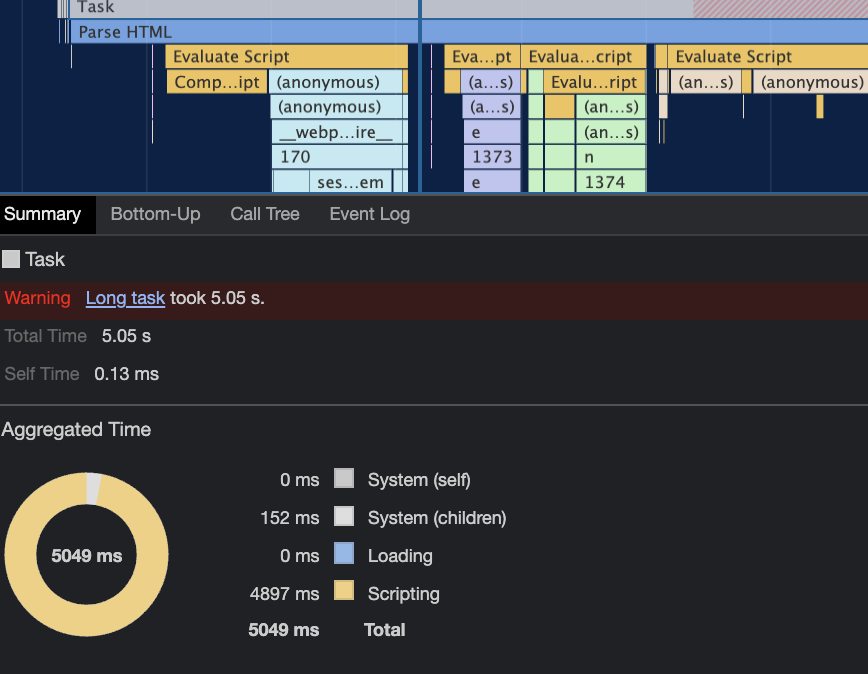

因为整个 js 代码是在这里进行的.

从上往下看,这一轮事件循环发生栏这些事情:

1. parse HTML:解析 HTML-即构建 dom 树
2. evaluate cript:执行 js 脚本,但解析 html 时遇到 js 标签,就开始执行 js 脚本,每次执行又都分为 compile script 和 anonymous 匿名函数执行
   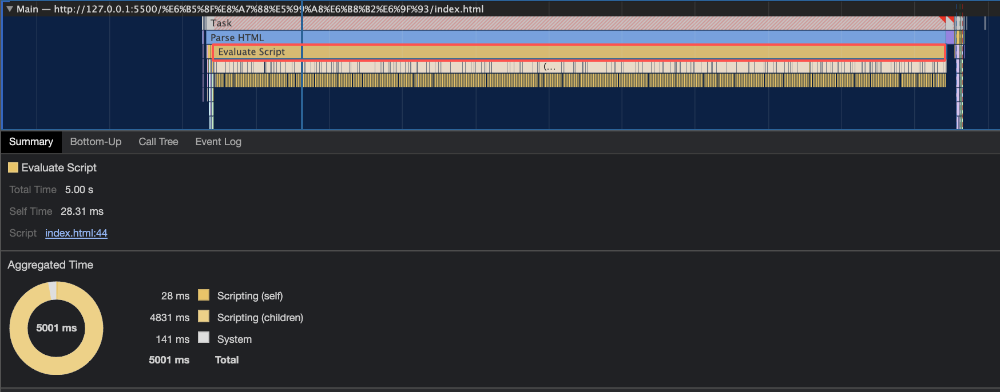
   可以看到,这个 js 脚本的执行花了 5s 才完成

接下来是第二个宏任务
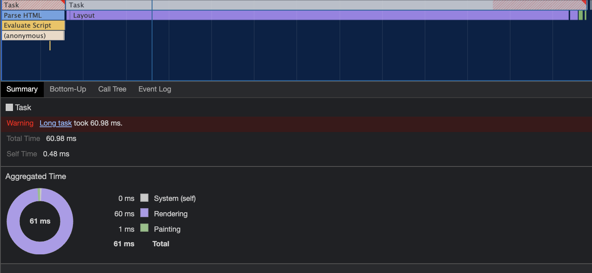

1. Recalculate Style:首先是计算样式,在宏任务一完成后 Recalculate Style 得到了 dom 树,现在可以开始计算 css 样式了,现在 dom 树上的节点有了样式
2. Layout:计算每一个元素的位置,得到一个布局树
3. Update Layer Tree:得到分层树,一些特定的节点会单独生成图层
4. Paint:输出一个图层绘制的指令列表!注意这里不是真正绘制,而只是得到一个指令顺序表!
5. Composite Layers:把不同图层的绘制列表合成

- 这时候主线程的第二个宏任务完成,但实际的绘制没有实现,交给合成线程去光栅化,即把一个个指令变成位图数据(位图:就是每一个点有一个颜色,把这个颜色用数字记录下来,即光栅化所做的事情)

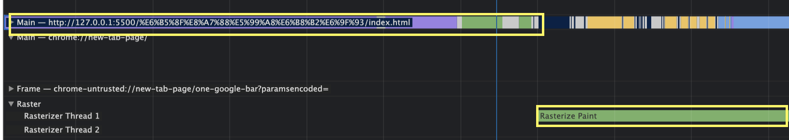

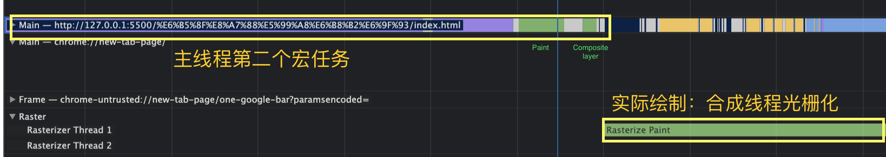

接下来页面才开始有变化:
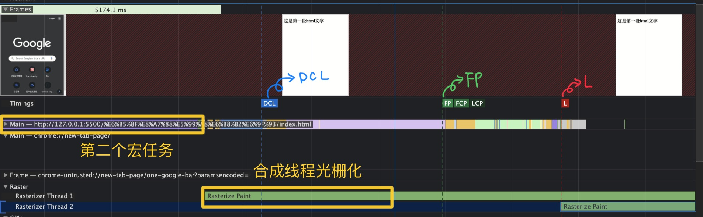

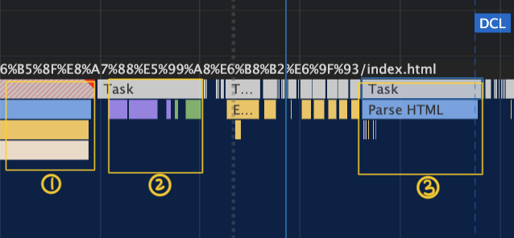

首先是三个关键指标:
DCL:DOMContentLoaded Event

HTML
是 HTML 文档（包括 CSS、JS）被加载以及解析完成之后触发（即 HTML->DOM 的过程完成 ）
解析完毕,因为有 js 的插入,分成三个宏任务才完成,第一此去执行完 js 脚本,第二次去渲染,第三次继续解析 html,完成整个 html 解析后,DCL 才被触发

FP:First Paint

看到在他之前页面空白，在他之后就有内容

Loaded:load 则是在页面的其他资源如图片、字体、音频、视频加载完成之后触发

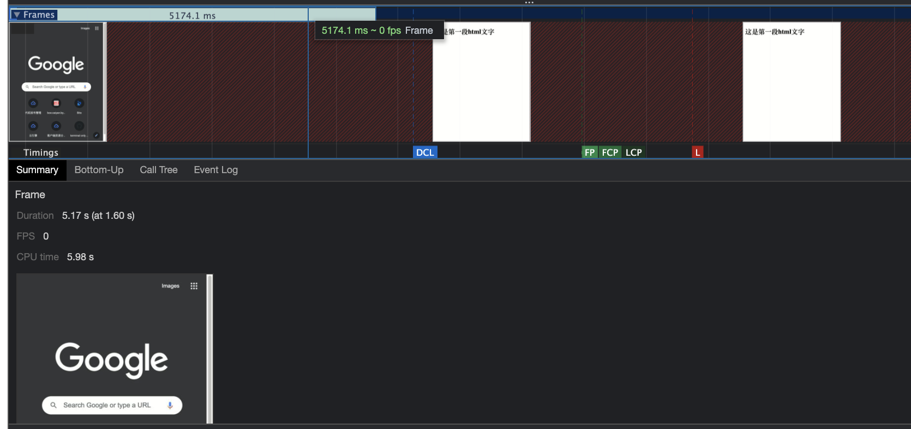

改变一下代码,插入两段 js 看看效果

```html
<!DOCTYPE html>
<html lang="en">
  <head> </head>
  <body>
    <h1>这是第一段html文字</h1>
    <script>
      let startOne = Date.now();
      while (Date.now() - startOne <= 5000) {}
    </script>
    <h1>这是第一段html文字</h1>
    <script>
      let startTwo = Date.now();
      while (Date.now() - startTwo <= 5000) {}
    </script>
  </body>
</html>
```

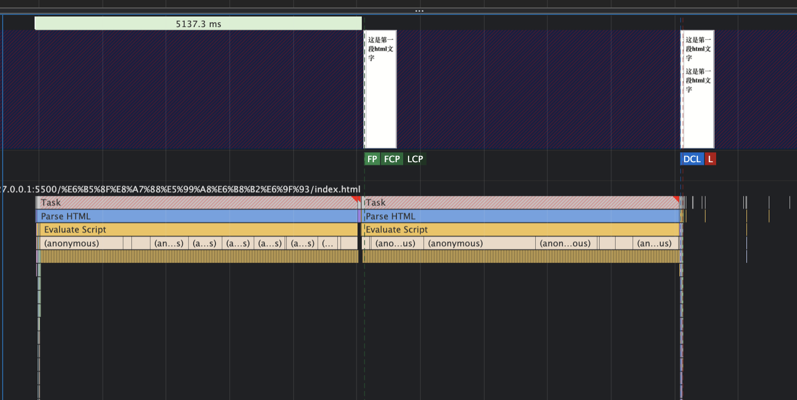
可以看到 页面发生了两次渲染
第一次绘制的时机在第一段 js 执行完成
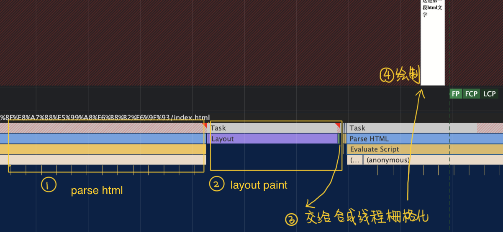
第二次绘制的时机也发生在 js 执行之后
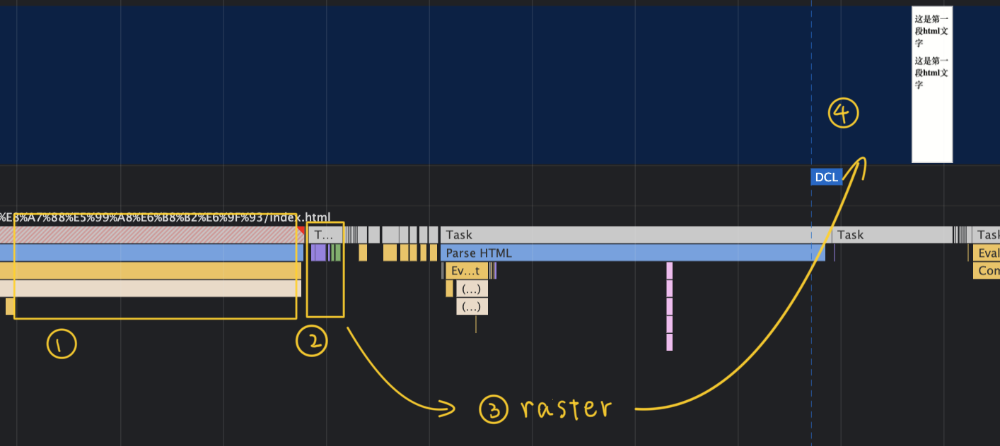

在浏览器的事件循环中,有微任务和宏任务的队列,执行一段同步的 js 代码,setTiemout 都会被视作一个宏任务,宏任务执行完成后会执行产生的微任务,这两步完成之后,就会触发页面的渲染.

这也就解释了为什么将 js 放在末尾引入还是让页面的渲染阻塞了.

因为 js 的执行没有阻塞 dom 树的构建,但是它使得本轮宏任务的执行时间太长,页面的渲染无法要轮到本轮后任务完成才能被执行.

js 和 dom 的解析是互斥的,原因是 js 可以改变 dom,如果浏览器的机制是在完成 dom 的构建,先去渲染到页面,再去执行 js,就很可能产生一种情况:js 修改了 dom,导致整个渲染又要重新来一次.
所以浏览器默认最坏情况:你会在 js 代码中修改 dom,触发重排/重绘,所以将页面的渲染放入下一轮宏任务中

那为什么我们还是坚持要把 js 放在最后引入?

1. 上面说了,js 可以访问 dom,如果 dom 树还没用完成构建,js 无法访问.

## 有没有办法让页面的渲染先与 js 执行呢?

```javascript
<!DOCTYPE html>
<html lang="en">
  <head> </head>
  <body>
    <h1>这是第一段html文字</h1>
    <script src="./index.js"></script>
    <h1>这是第一段html文字</h1>
  </body>
</html>
```

```js
function ano() {
  let startOne = Date.now();
  console.log("123");
  while (Date.now() - startOne <= 5000) {}
}
ano();
```

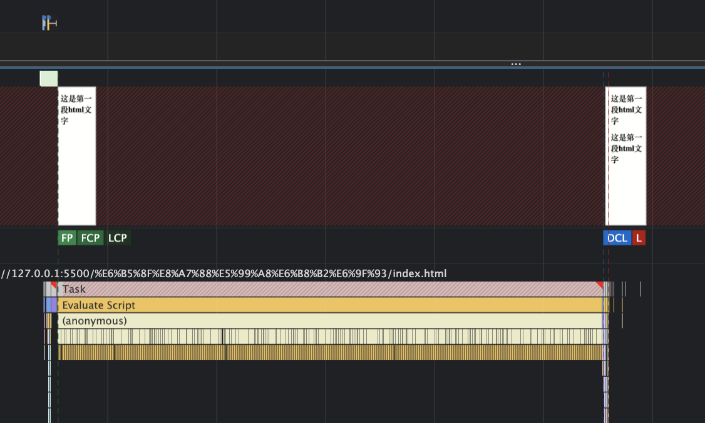
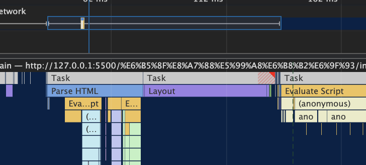

将 js 文件作为外部资源引入,发现,可以在 dom 解析完成后立即执行渲染,但是这是因为解析到 js 标签时资源还没有请求来,还是这种方式真的有效呢,资源请求的速度没法加快,但是可以把 html 的解析时间变得更长

```javascript
<!DOCTYPE html>
<html lang="en">
  <head> </head>
  <body>
    <h1>这是第一段html文字</h1>
    <script src="./index.js"></script>
    <h1>这是第一段html文字</h1>
    <script src="./index.js"></script>
  </body>
</html>
```

```js
function ano() {
  let startOne = Date.now();
  console.log("123");
  while (Date.now() - startOne <= 5000) {}
}
ano();
```

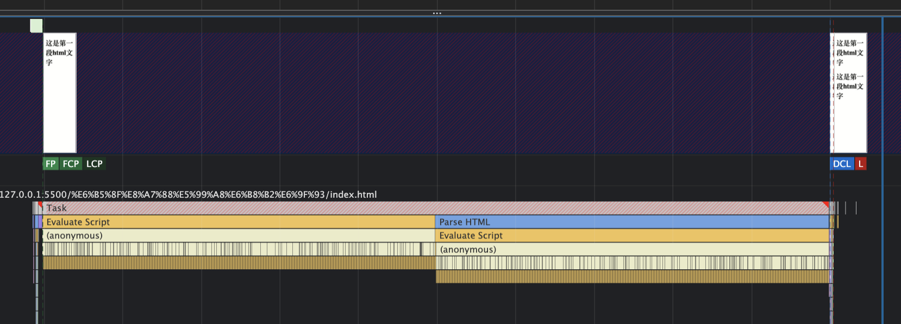

```html
<!DOCTYPE html>
<html lang="en">
  <head> </head>
  <body>
    <h1>这是第一段html文字</h1>
    <script>
      let startOne = Date.now();
      while (Date.now() - startOne <= 5000) {}
    </script>
    <h1>这是第一段html文字</h1>
    <script src="./index.js"></script>
    <h1>这是第一段html文字</h1>
  </body>
</html>
```

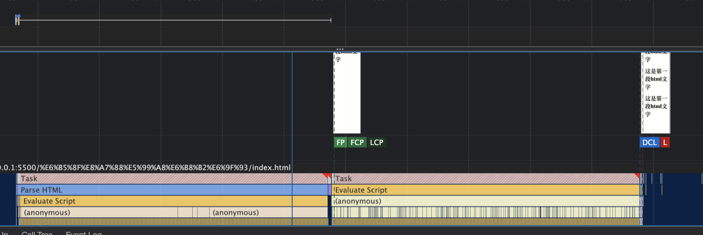

从上面几个例子可以看出,解析到 html 中 js 时:

1. 如果内嵌的 js,前面的 html 解析+内嵌 js 的执行是一整个宏任务,然后再是页面刷新
2. 如果是外部引入的 js,前面的 html 解析是一个单独的宏任务-》页面刷新;接着是外部引入的 js 执行+后面的 html 解析-》触发一次页面刷新
3. 内联的 js 可以包括一块 html,外部引入的 js 一定是一个单独的宏任务

使得 html 在 js 执行之前发生一次渲染的方法:
使 html 解析中断
使得 js 在解析到 script 标签时还没用加载好:外联(通常不走强缓存都会中断)

如果强缓存生效,可以加上 defer(async 没有用)

加上 defer

```html
<!DOCTYPE html>
<html>
  <head>
    <meta
      http-equiv="Cache-Control"
      content="no-cache, no-store, must-revalidate"
    />
    <meta charset="UTF-8" />
    <title>demo</title>
  </head>
  <body>
    <div id="app">
      <p id="p">html中原来的文字</p>
    </div>
    <script defer src="./index.js"></script>
  </body>
</html>
```

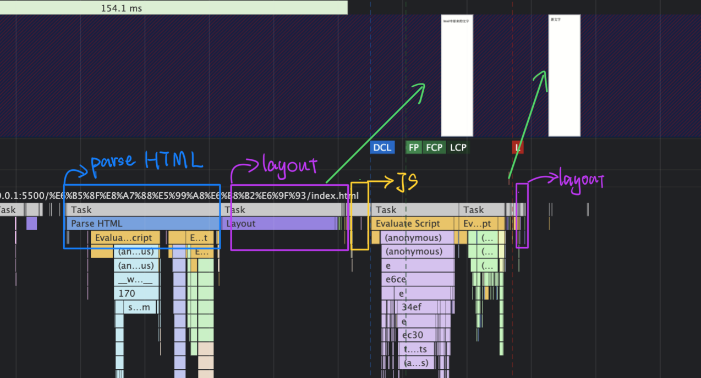

htmlparse 不会中断

```html
<!DOCTYPE html>
<html>
  <head>
    <meta
      http-equiv="Cache-Control"
      content="no-cache, no-store, must-revalidate"
    />
    <meta charset="UTF-8" />
    <title>demo</title>
  </head>
  <body>
    <div id="app">
      <p id="p">html中原来的文字</p>
    </div>
    <script src="./index.js"></script>
  </body>
</html>
```

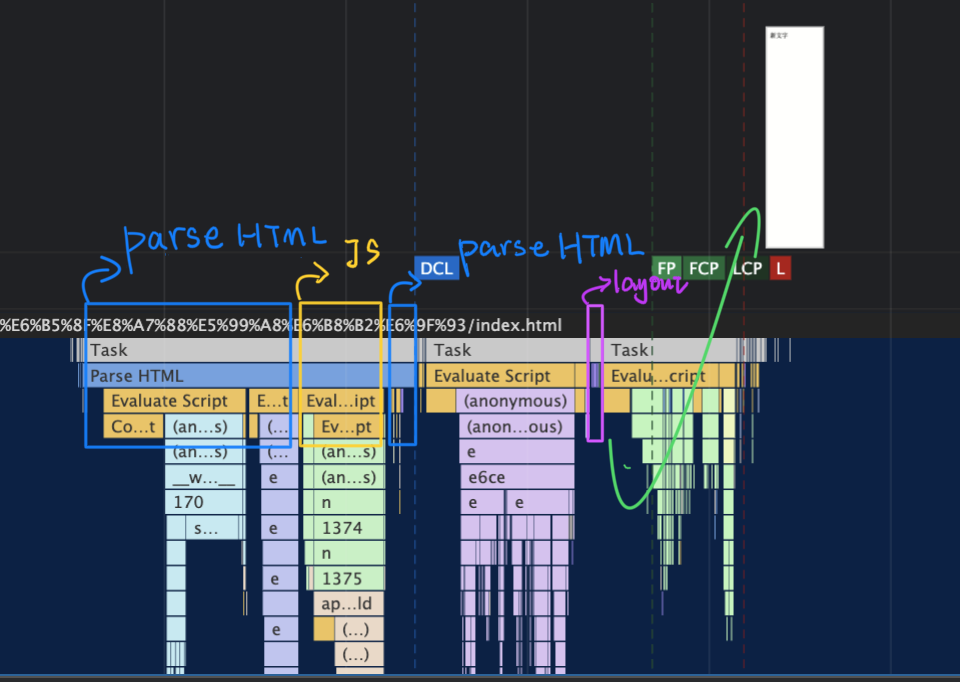
