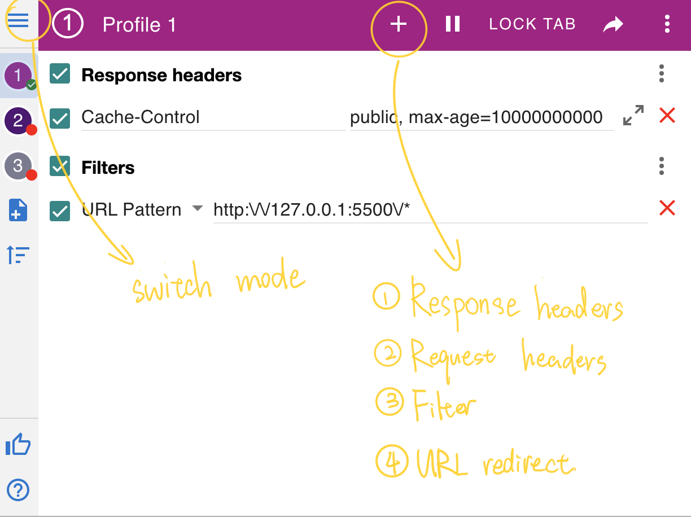
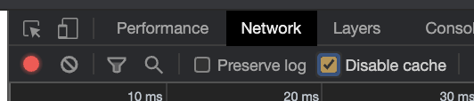
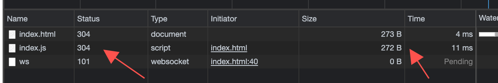

## 使用工具

### live server

提供 html 和 js 等静态资源的服务器

```html
<!DOCTYPE html>
<html>
  <head>
    <meta charset="UTF-8" />
    <title>demo</title>
  </head>
  <body>
    <div id="app">
      <p>html文件中的文字</p>
    </div>
    <script src="./index.js"></script>
  </body>
</html>
```

```js
function ano() {
  let root = document.getElementById("app");
  let newNode = document.createElement("div");
  newNode.innerText = "新文字";
  root.appendChild(newNode);
}
ano();
```

### chrome MobHeader

修改响应头



[Response headers]Cache-Control:public, max-age=10000

> 注意,单位是 s

[Filters]URL Pattern:http:\/\/127.0.0.1:5500\/\*

## 不使用缓存


### 服务器禁止缓存


### 浏览器禁止



### html meta 标签禁止缓存

```html
<meta
  http-equiv="Cache-Control"
  content="no-cache, no-store, must-revalidate"
/>
<meta http-equiv="Pragma" content="no-cache" />
<meta http-equiv="Expires" content="0" />
<meta charset="UTF-8" />
```

> 这里的对象是引入的文件而不是本身
> 经测试:没有用,如果 js 文件相应头里面设了强缓存,还是会用缓存
> 但效果一般。因为只被少数几个浏览器宠幸，而代理缓存基本上就不访问 HTML 文档。

## 强缓存

> 强缓存对 html 不起作用
> 
> 给返回的 html 文件加上强缓存,但每一都是 304,即会去问一次服务器,本地资源是否可用


**如果是命中缓存 200 一定是 from cache,403 一定不是 from cache**

### 服务器设置


## 协商缓存



### 服务器设置


